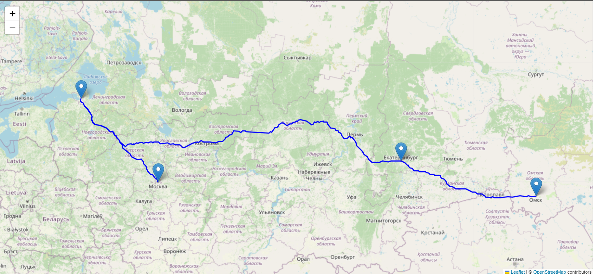

# Route Optimization and Visualization

This project provides a Python-based tool for optimizing delivery routes and visualizing them on a map. It uses Open Source Routing Machine (OSRM) for road-based routing and SciPy for optimizing the order of visited locations.

---

## Features

- **Route Optimization**: Calculates the optimal order for visiting locations using the Hungarian algorithm (SciPy).
- **Route Visualization**: Displays the optimized route on an interactive map using Folium.
- **Real-World Roads**: Fetches routes and distance matrices using the OSRM API.

---

## Requirements

- Python 3.8+
- OSRM API
- Libraries:
  - `folium`
  - `requests`
  - `numpy`
  - `scipy`


## Let`s start

`Clone repo`
```bash
git clone https://github.com/ai-fn/route-builder.git
```

`Install the dependencies using:`
```bash
pip install -r req.txt
```

# Usage Example
```python
from delivery_routes import RouteBuilder

# Define locations for route building
locations = {
    "warehouse": (55.7558, 37.6173),  # Moscow
    "client_1": (59.9343, 30.3351),  # St. Petersburg
    "client_2": (56.8389, 60.6057),  # Yekaterinburg
    "client_3": (54.9784, 73.3822),  # Omsk
}

# Build and save the route
rb = RouteBuilder(locations)
rb.build()

# You can also provide filename as arg to the 'build' func
filename = "route.html"
rb.build(filename)
```

## Result
`As you can see in the terminal, the route is saved to the file:`
```bash
2024-09-13 19:26:08,964 - INFO - The route is saved to a file 'optimized_route.html'
2024-09-13 19:26:09,175 - INFO - The route is saved to a file 'route.html'
```
`If you open the results file, you will see a map with the constructed route for the specified locations:`


